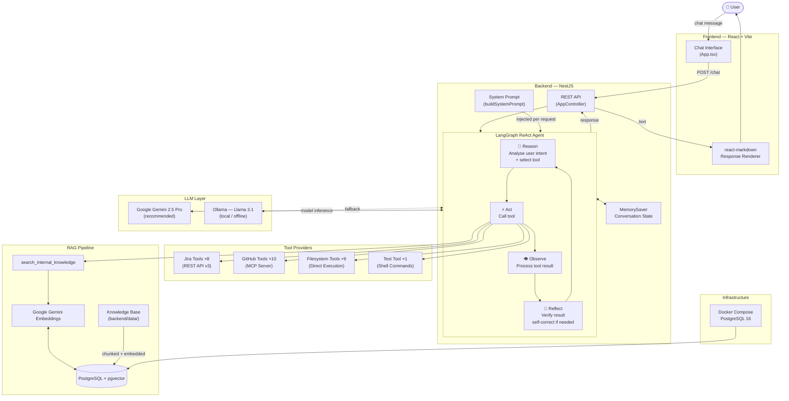

# DevAssist Agent - AI-Powered developmentwwwwww Assistant

> **Ciklum AI Academy Capstone Project** - An autonomous AI agent that integrates Jira, GitHub, filesystem operations, and RAG-based knowledge retrieval to automate development workflows.

## 📋 Table of Contents

- [Overview](#overview)
- [Features](#features)
- [Architecture](#architecture)
- [Tech Stack](#tech-stack)
- [Prerequisites](#prerequisites)
- [Installation](#installation)
- [Configuration](#configuration)
- [Usage](#usage)
- [Project Structure](#project-structure)
- [Available Tools](#available-tools)
- [Development](#development)
- [Testing](#testing)

## 🎯 Overview

DevAssist Agent is an AI-powered development assistant that demonstrates the core components of modern agentic AI systems:

- **RAG Pipeline**: Retrieves relevant information from internal knowledge bases using vector embeddings
- **Reasoning & Reflection**: Uses LangGraph's ReAct agent pattern for multi-step reasoning and self-correction
- **Tool-Calling**: 29 tools across Jira, GitHub, filesystem operations, and testing
- **Memory**: Maintains conversation history and task state using LangGraph's memory system
- **MCP Integration**: Leverages Model Context Protocol for external service integrations

The agent can autonomously:

- Manage Jira tasks (create, assign, transition status)
- Perform GitHub operations (create branches, PRs, search code)
- Execute filesystem operations (read, write, search files)
- Run tests and analyze results
- Search internal documentation using RAG

**Note on Architecture:**

- Jira integration uses **direct REST API** (not MCP) to demonstrate tool flexibility — tools can be built via REST API, MCP, shell commands, or any transport mechanism
- GitHub integration uses **Model Context Protocol (MCP)** server as a comparison point
- This shows that agentic systems aren't locked into a single integration pattern

**Note on Code Quality:**
This codebase intentionally contains realistic code quality issues (e.g., hardcoded credentials, suboptimal file organization) that serve as test cases for the agent to identify and autonomously fix. These are not oversights but deliberate scenarios to showcase the agent's ability to improve codebases without human intervention.

## ✨ Features

### 🔧 Core Capabilities

- **Jira Integration**: Full task management lifecycle
- **GitHub Operations**: Branch creation, commits, PRs with automated details
- **Filesystem Tools**: Safe file operations within workspace boundaries
- **Test Execution**: Run and verify tests in specific directories
- **RAG-Based Knowledge**: Query internal documentation and guidelines
- **Multi-Model Support**: Google Gemini 2.5 Pro or local Ollama models (Llama 3.1, Qwen 2.5)

### 🧠 AI Reasoning

- **Self-Reflection**: Agent analyzes tool responses and adjusts strategies
- **Error Recovery**: Retries with different approaches when operations fail
- **Context Awareness**: Maintains conversation history and task state
- **Tool Call Logging**: Tracks all tool invocations for debugging

### 🔒 Security

- Workspace boundary enforcement (no access outside configured directory)
- Read-only git command restrictions
- Command allowlist for test runners
- No arbitrary shell command execution

## 🏗 Architecture



The system follows a multi-layered architecture:

- **Frontend**: React-based chat interface (Vite + TypeScript)
- **Backend**: NestJS with LangGraph ReAct agent for autonomous reasoning
- **Tools Layer**: 29 tools using diverse integration patterns:
  - Jira: Direct REST API (Jira Cloud v3)
  - GitHub: Model Context Protocol (MCP) server
  - Filesystem & Tests: Direct command execution
  - Knowledge: RAG via pgvector similarity search
- **Data Layer**: PostgreSQL with pgvector for RAG retrieval
- **AI Models**: Gemini 2.5 Pro (primary) with Ollama/Llama 3.1 fallback

## 🛠 Tech Stack

### Backend

- **Framework**: NestJS (Node.js)
- **AI/Agent**: LangChain's `createAgent` API (built on LangGraph) with MemorySaver for conversation state
- **Reasoning**: ReAct pattern (Reason → Act → Observe → Reflect)
- **Models**: Google Gemini 2.5 Pro or Ollama (Llama 3.1 / Qwen 2.5)
- **Vector Store**: PostgreSQL with pgvector extension
- **Embeddings**: Ollama `nomic-embed-text` (local)
- **MCP**: Model Context Protocol SDK for Jira/GitHub integration
- **Language**: TypeScript

### Frontend

- **Framework**: React 19 + Vite
- **Styling**: TailwindCSS 4 + Typography plugin
- **Markdown**: react-markdown for rendering agent responses
- **Language**: TypeScript

### Infrastructure

- **Database**: PostgreSQL 16 + pgvector
- **Containerization**: Docker Compose
- **Testing**: Jest (unit + e2e)

## 📦 Prerequisites

- **Node.js**: v18+ (recommended v20+)
- **Yarn**: v1.22+
- **Docker**: v20+ (for PostgreSQL)
- **Docker Compose**: v2+
- **Google API Key**: For Gemini model (optional — can use local Ollama instead)
- **Ollama**: Required for local embeddings (`nomic-embed-text`) and optional local LLM
- **Jira Account**: API token + project access
- **GitHub Account**: Personal Access Token

## 🚀 Installation

### 1. Clone Repository

```bash
git clone https://github.com/DanelGorgan/dev-assist-agent.git
cd dev-assist-agent
```

### 2. Start Database

```bash
docker-compose up -d
```

This starts PostgreSQL with pgvector on port `5433`.

### 3. Install Dependencies

```bash
# Backend
cd backend
yarn install

# Frontend
cd ../frontend
yarn install
```

### 4. Configure Environment Variables

Create `backend/.env` with the following:

```bash
# Google AI (Recommended)
USE_GEMINI=true
GOOGLE_API_KEY=your_gemini_api_key_here

# Or use local Ollama
USE_GEMINI=false
OLLAMA_MODEL=llama3.1

# Jira Configuration
JIRA_EMAIL=your-email@example.com
JIRA_API_TOKEN=your_jira_token
JIRA_BASE_URL=https://your-domain.atlassian.net
JIRA_PROJECT_KEY=DEV

# GitHub Configuration
GITHUB_PERSONAL_ACCESS_TOKEN=your_github_token

# Workspace (optional)
WORKSPACE_DIR=/path/to/your/project
```

### 5. Ingest Knowledge Base

First, pull the required Ollama models:

```bash
ollama pull nomic-embed-text   # required for RAG embeddings
ollama pull llama3.1           # required if USE_GEMINI=false
```

Then seed the RAG vector store with the documentation:

```bash
curl -X POST http://localhost:3000/api/knowledge/ingest
```

This reads all markdown files from `backend/data/`, chunks them, generates embeddings locally via `nomic-embed-text`, and stores them in PGVector. Only needs to be run **once** (or whenever you update the docs).

## ▶️ Usage

### Start Backend

```bash
cd backend
yarn start:dev
```

Backend runs on `http://localhost:3000`

### Start Frontend

```bash
cd frontend
yarn dev
```

Frontend runs on `http://localhost:5173`

### Example Prompts

```
"Are there unassigned tasks?"
"Assign DEV-8 to me and move it to In Progress"
"Get details for DEV-8"
"Create a branch for DEV-8"
"Run tests in backend/"
"Search for authentication in our docs"
"Create a PR for DEV-8"
```

## 📁 Project Structure

```
dev-assist-agent/
├── backend/
│   ├── src/
│   │   ├── app.service.ts          # Main agent orchestration
│   │   ├── knowledge/               # RAG module (vector store)
│   │   ├── tools/                   # Tool providers
│   │   │   ├── tools.service.ts
│   │   │   ├── tools.module.ts
│   │   │   ├── jira-tools.provider.ts
│   │   │   ├── github-tools.provider.ts
│   │   │   ├── filesystem-tools.provider.ts
│   │   │   └── test-tools.provider.ts
│   │   └── prompts/                 # System prompts
│   ├── data/                        # Documentation for RAG
│   └── test/                        # Tests
├── frontend/
│   ├── src/
│   │   ├── App.tsx                  # Main chat interface
│   │   └── components/
├── docker-compose.yml               # PostgreSQL + pgvector
└── README.md
```

## 🔧 Available Tools

### Jira Tools (8)

- Create tickets, list all/unassigned issues, get issue details
- Assign tasks, get and execute transitions
- Get current user identity

### GitHub Tools (10)

- Create branches, commit local changes, push code
- Create pull requests (with automated Jira details)
- Search code/issues, get file contents
- Create/update/delete files in repo
- Get current branch, run git commands

### Filesystem Tools (9)

- Read, write, append, edit files
- Search files by extension or keyword
- Move files with automatic import path updates
- Delete files, list directory contents
- Safe workspace boundary enforcement

### Test Tools (1)

- Run tests in specified directories
- Supports yarn/npm test commands

### RAG Tool (1)

- Search internal knowledge base using vector similarity

## 📊 Evaluation

The agent's effectiveness is measured across four dimensions:

| Dimension                   | How It's Measured                                                                                                                                                                                                             |
| --------------------------- | ----------------------------------------------------------------------------------------------------------------------------------------------------------------------------------------------------------------------------- |
| **Tool Call Accuracy**      | Every invocation is logged with tool name and count. The correct tool must be called for each command type (e.g., `create_pr_from_local_changes` for "Create PR for DEV-X").                                                  |
| **Hallucination Detection** | Built-in warning fires when the agent makes 0 tool calls (`❌ WARNING: No tools were called!`), indicating the model may be hallucinating a response.                                                                         |
| **RAG Relevance**           | Vector similarity search returns the top-3 most relevant chunks from the knowledge base. The knowledge base is curated to the agent's domain (tools, guidelines, model config).                                               |
| **Model Comparison**        | Tested empirically across multiple LLMs — Gemini 2.5 Pro handles complex multi-tool workflows reliably; Llama 3.1 (local) struggles with 3+ sequential tool calls, requiring a single-action command pattern as a workaround. |

End-to-end workflow validation:

1. List unassigned Jira tasks → correct tasks returned
2. Assign task + transition to In Progress → Jira status updated
3. Move test files → filesystem changes verified
4. Run tests → pass/fail result reported
5. Create PR → PR URL returned with correct title/description from Jira

## 🧪 Testing

```bash
# Backend unit tests
cd backend
yarn test

# Backend e2e tests
yarn test:e2e

# Frontend tests
cd frontend
yarn test
```

## 🔄 Development

### Add New Tool

1. Create tool in appropriate provider (`backend/src/mcp/*.provider.ts`)
2. Define schema using Zod
3. Implement async `func` method
4. Tool automatically available to agent

### Add Documentation to RAG

1. Add markdown files to `backend/data/`
2. Run ingestion script (or restart backend)
3. Agent can now search this content

## 🚀 Future Improvements

### Short-term Enhancements

1. **LangGraph Workflows for Better Reflection**
   - Migrate from `createAgent` to explicit LangGraph state machines
   - Implement persistent reflection loops (agent reviews own decisions across turns)
   - Add real-time streaming output similar to Claude Code / Cursor (show thinking + actions as they happen)
   - Enable branching workflows for parallel reasoning paths

2. **Intelligent Tool Injection**
   - Implement similarity search (RAG) to inject only relevant tools into system prompt based on user intent
   - Reduce token usage by avoiding irrelevant tool schemas
   - Compare: current method (all 29 tools always injected) vs. selective injection
   - Measure impact on token count, latency, and accuracy

3. **Production Readiness Metrics**
   - Benchmark: POC vs. production-grade deployment
   - Measure: token usage per request, latency (p50/p95/p99), cost per interaction
   - Implement request caching for repeated queries
   - Add request rate limiting and quota management

### Medium-term Features

4. **Enhanced Code Modification Tools**
   - `auto_add_unit_tests` — generate tests for modified functions using LLM
   - `fix_code_issue` — analyze error logs and autonomously fix code
   - `apply_nestjs_di_pattern` — refactor code to follow NestJS dependency injection conventions
   - `generate_migrations` — create database migrations for schema changes

5. **Advanced RAG Integration**
   - Hybrid search: combine semantic (vector) + keyword (BM25) search for knowledge base
   - Cross-document linking in RAG (agent understands relationships between docs)
   - Versioned knowledge base (track updates to documentation)

6. **Multi-Agent Collaboration**
   - Specialized agents for different domains (DevOps, Code Review, Documentation)
   - Agent-to-agent communication for complex tasks
   - Consensus-based decision making for high-risk operations (e.g., force push, delete branch)

### Observability & Monitoring

- Structured logging for all tool calls (JSON format for log aggregation)
- OpenTelemetry integration for distributed tracing
- Agent reasoning visualization (render decision tree for each interaction)
- Cost tracking per agent per user

## 🎓 Learning Resources

- [LangChain Documentation](https://js.langchain.com/docs)
- [LangGraph Guide](https://langchain-ai.github.io/langgraphjs/)
- [Model Context Protocol](https://modelcontextprotocol.io/)
- [NestJS Documentation](https://docs.nestjs.com/)

## 📝 License

MIT

## 🙏 Acknowledgments

Built as part of the Ciklum AI Academy program. Special thanks to the instructors and mentors for their guidance on agentic AI systems, RAG pipelines, and tool-calling architectures.
